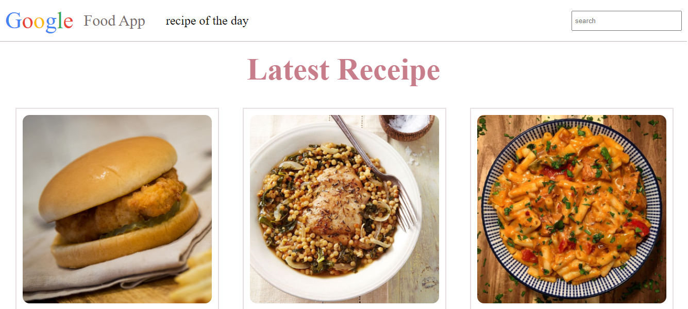
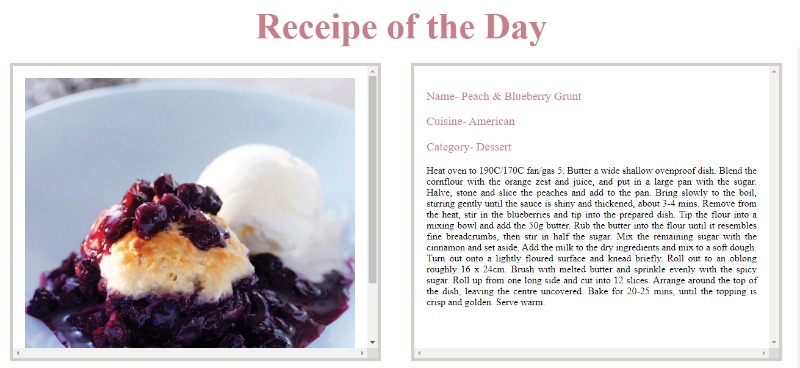
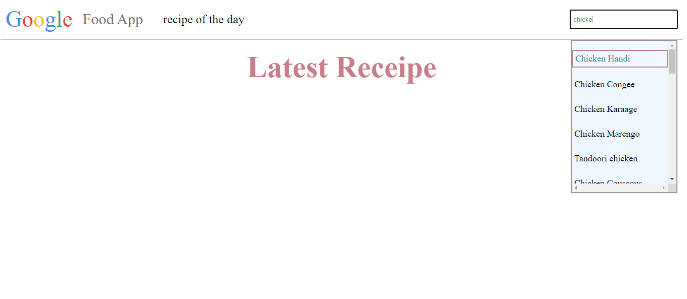
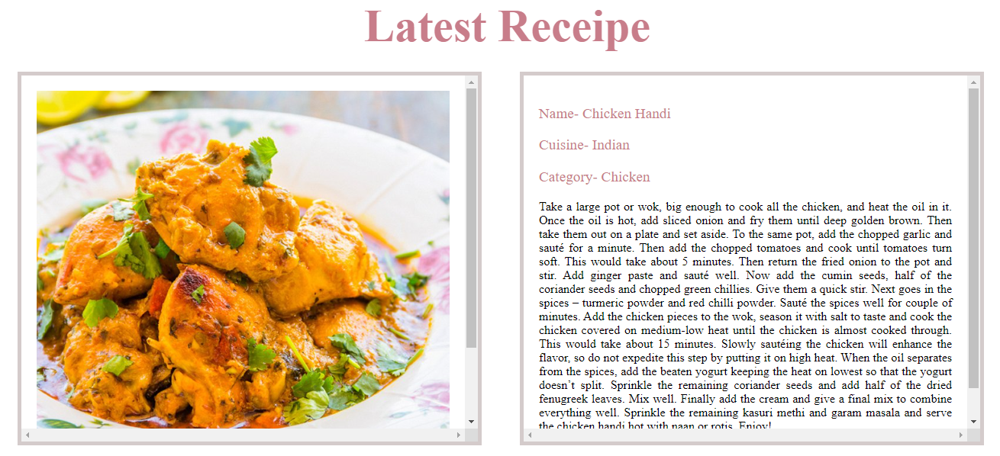

# Food Recipe APP🌐

**Food Recipe APP** is a platform, that shows the recipe of a product to the user's needs, In this project, I have tried to make a look-alike clone of the Food Recipe APP.

# Technology Stack Used 💻

In this project we have used the following tech stack.

- HTML: [HTML](https://developer.mozilla.org/en-US/docs/Web/HTML)
- CSS: [CSS](https://developer.mozilla.org/en-US/docs/Web/CSS)
- JavaScript:[JavaScript](https://developer.mozilla.org/en-US/docs/Web/JavaScript)

 

## Libraries Used 🌟

1. Images: [themealdb](https://www.themealdb.com)
2. Icons:[Awesome Icon](https://www.w3schools.com/icons/fontawesome5_intro.asp)
3. Fonts: [Google Fonts](https://fonts.google.com/)

 

## How to run the project 📑

In this project, we were able to achieve a near to perfect clone of the original website. As we do not want to overwhelm you, we haven't shared all the pages here. Please fork the repository and then use it on your own. If you want to collaborate with us on this project then please feel free to reach out to us.

You can also take a glimpse of our Project, just follow the below steps:

    1. Copy the path of index.html and paste it into your browser.

    2. On Our website Users can see various Recipe.
 

## Snapshots 📷

1. Landing Page

   
   
2. Recipe of the day

   

3. Search Bar

   

4. Search Bar Output

   

 

## Features ✨

1. User can see various latest reciipe
3. User can search in search bar, output will come with debouncing 
4. User can see the Recipe of the Day

 

## Demo

[Food Recipe App](https://heartfelt-centaur-27da12.netlify.app/)

 

##  Contributor 😇

👤 **Hemant Suryawanshi**

- Github: [hemant-suryawanshi](https://github.com/hemant-suryawanshi)
